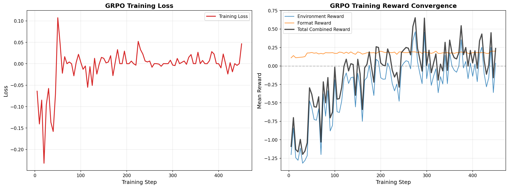

# SepsisGuard — Teaching AI to Save Lives from Sepsis

**Multi-Agent Clinical Coordination Environment | OpenEnv Hackathon 2026**

> *This project is a research prototype for early warning coordination only. It is not intended as medical advice and should not be used for clinical decision-making.*

**[🌐 Live Environment](https://huggingface.co/spaces/Jishnu-Vijayan-03/Sepsis-Guard)** | **[💻 GitHub](https://github.com/JishnuVijayan/Sepsis-Guard)** | **[📓 Training Notebook](https://huggingface.co/spaces/Jishnu-Vijayan-03/Sepsis-Guard/blob/main/training/colab_training_sepsisguard.ipynb)** | **[📝 Blog](https://huggingface.co/spaces/Jishnu-Vijayan-03/Sepsis-Guard/blob/main/BLOG.md)** | **[🤖 Trained Model](https://huggingface.co/buckets/PhoeniX9651/sepsis-storage/tree/sepsis-model/sepsis-grpo-v3-lora)**

---

## The Problem

**11 million people die from sepsis every year** — roughly 20% of all global deaths. ([WHO](https://www.who.int/news-room/fact-sheets/detail/sepsis)) That is more than all cancer deaths combined, with nearly 49 million cases annually. Yet most people have never heard of it.

Sepsis is what happens when your own immune system — the system meant to protect you — turns against you. A small infection: a UTI, a cut, a chest infection. The immune response escalates out of control, organs begin to fail, blood pressure drops. The window to reverse it is measured in hours, not days.

The cruel irony is that **the treatment is simple.** Fluids and antibiotics. Every hospital has them. The problem is not treatment — it is detection.

Here is why detection fails: a septic patient often looks like many other sick patients. They already have pneumonia, a UTI, a post-surgical complication. The signs — a rising heart rate, a falling blood pressure, an abnormal lab result — are scattered across four different people who rarely sit in the same room.

- The **nurse** sees that a patient's heart rate has been climbing all shift.
- The **lab analyst** sees that their lactate is elevated, but doesn't know the vitals.
- The **pharmacist** knows the patient is on immunosuppressants, which silences the usual fever response.
- The **physician** sees none of this until someone escalates — and in a busy ward, no one has time.

**Every hour of delayed antibiotics increases mortality by approximately 7%.** Not eventually. Each hour.

Modern hospitals are computerized. The data exists. What is missing is a coordinator that never sleeps, never gets overwhelmed, and can hold all four views at once.

---

## Why This Is Unexplored

AI in clinical settings faces significant regulatory and liability constraints — and rightly so. But **monitoring and coordination** is a different class of problem from diagnosis and treatment. An early warning system that says "these four signals, when they appear together, historically precede sepsis by several hours" carries a very different risk profile than one that prescribes drugs. Sepsis can be detectable 4–6 hours before clinical complications appear. A coordinating agent does not need to replace the physician — it needs to make sure the physician sees the right information at the right time.

No RL training environment exists for this coordination problem. SepsisGuard is a first attempt to build one.

---

## The Environment

SepsisGuard runs inside OpenEnv as a FastAPI server. It simulates a hospital ward over 24–72 simulated hours (each step = 30 minutes).

Four agents operate simultaneously with **asymmetric information** — no single agent can diagnose sepsis alone:

| Agent | What They See | What They Cannot See |
|---|---|---|
| **Nurse** | Vitals for 5 assigned patients | Lab results, medications |
| **Lab Analyst** | Lab values for all patients | Vitals, medications |
| **Pharmacist** | Medication lists, resistance rates | Vitals, lab values |
| **Physician** | Only what others formally escalate | Everything else |

The nurse must decide whether vital signs are abnormal enough to escalate — but over-escalating degrades physician trust (alarm fatigue), making future valid warnings less effective. The lab analyst must flag critical values, but the physician never sees them directly. The pharmacist knows which patients are immunosuppressed (which masks normal sepsis signs). The physician must synthesize whatever fragments arrive and act on incomplete information.

This is not a simplified toy. This is how hospitals actually work.

### Three Difficulty Levels

| Task | Patients | Sepsis Cases | False Alarms | Duration | Pass Threshold |
|---|---|---|---|---|---|
| **Task 1 — Textbook** | 5 | 1 | 0 | 24h (48 ticks) | 0.70 |
| **Task 2 — Atypical** | 10 | 3 | 0 | 48h (96 ticks) | 0.55 |
| **Task 3 — High Acuity** | 10 | 4 | 2 | 72h (144 ticks) | 0.40 |

False alarm patients mimic sepsis signs without infection. Immunosuppressed patients show blunted fever and WBC responses. Lab results are delayed 1–3 ticks depending on task difficulty.

### Scoring

```
team_score = 0.40 × (treated_in_time / sepsis_patients)
           + 0.25 × (1.0 − false_alarm_rate)
           + 0.20 × coordination_score
           + 0.15 × time_efficiency
```

---

## Training

We trained **Qwen2.5-3B-Instruct** (4-bit quantized) using **TRL GRPO** (Grouped Relative Policy Optimization) on Task 1 (textbook case) in HuggingFace. A single model serves all four roles via role-conditioned system prompts.

The reward function connects directly to the live environment: the model generates an action, the environment steps forward, the per-step clinical outcome determines the reward. This is not evaluated on a static dataset — the model is graded on what actually happens to the patient when its action is executed.

Training was run for ~450 steps on a HF A10G GPU.

### Results



*Left: GRPO training loss across 450 steps. Right: Reward convergence — environment reward (blue), format reward (orange), total combined reward (black).*

.png)

*Left: Pre-training vs. post-training scores per role against heuristic baseline. Right: Score delta per role after training.*

| Role | Heuristic Baseline | Pre-Training | Post-Training | Change |
|---|---|---|---|---|
| Nurse | 0.8176 | 0.7526 | 0.8425 | **+0.090** |
| Lab Analyst | 0.8176 | 0.3998 | 0.6500 | **+0.250** |
| Pharmacist | 0.8176 | 0.6700 | 0.7625 | **+0.093** |
| Physician | 0.8176 | 0.7552 | 0.4500 | −0.305 |

Three of four roles improved meaningfully after training. The Lab Analyst — which started furthest from baseline — improved the most (+0.25), learning to flag critical values at the right moment.

The Physician did not improve and actually degraded. This is expected and informative, not a failure. The physician role is structurally the hardest: it acts on incomplete information assembled by three other agents, must weigh sepsis against false alarms, and carries the highest-stakes decisions (antibiotics, ICU admission). A 30-hour hackathon with Task 1 data is not enough to fine-tune this role well. The physician needs more training data, a more varied task curriculum, and likely a larger base model to learn the conditional reasoning this role requires.

The current results are a proof of concept: **it is possible to train LLM agents on this coordination problem and show measurable improvement.**

---

### Follow-up Experiment: SFT + GRPO on Task 1 + Task 2

**Baseline issue:** Physician underperformed in the first run, degrading despite other roles improving.

**Intervention:** We ran a follow-up experiment using SFT followed by GRPO training across a broader curriculum (Task 1 + Task 2) with revised reward shaping designed to better reflect the physician's decision complexity.

**Outcome:** Physician scores improved relative to the first run. In the Task 2 evaluation the physician reached 0.3883 (up from 0.4500→degraded in run 1), with the revised reward shaping providing a clearer learning signal for multi-source escalation decisions.


*Left: GRPO Task 2 reward curves (~200 steps). Center: Task 1 generalization scores (pre vs. post Task 2 GRPO). Right: Task 2 per-role scores — physician improved to 0.39 vs. heuristic baseline of 0.378.*


*Full post-training evaluation across both tasks. Physician delta: +0.1975 on Task 1, +0.0500 on Task 2.*

| Task | Role | Heuristic | Pre-Train | Post-Train | Delta |
|---|---|---|---|---|---|
| task1_textbook | Nurse | 0.7175 | 0.6600 | 0.6600 | +0.000 |
| task1_textbook | Lab | 0.7175 | 0.6600 | 0.6600 | +0.000 |
| task1_textbook | Pharmacist | 0.7175 | 0.6600 | 0.6600 | +0.000 |
| task1_textbook | Physician | 0.7175 | 0.4575 | 0.6550 | **+0.198** |
| task2_atypical | Nurse | 0.3783 | 0.4342 | 0.4342 | +0.000 |
| task2_atypical | Lab | 0.3783 | 0.3725 | 0.3725 | +0.000 |
| task2_atypical | Pharmacist | 0.3783 | 0.4342 | 0.4342 | +0.000 |
| task2_atypical | Physician | 0.3783 | 0.3383 | 0.3883 | **+0.050** |

**Caveat:** In a follow-up SFT+GRPO experiment with a broader curriculum (Task 1+2) and revised reward shaping, physician scores improved relative to our first run, providing preliminary support for our hypothesis that physician performance is bottlenecked by curriculum depth and reward design. However, gains are not yet uniform across roles and require larger-scale evaluation to confirm.

---

## Why It Matters

Sepsis is not a rare edge case. It is the most common cause of death in hospitals worldwide. It kills more people each year than heart attacks, strokes, and all cancers combined. And unlike many of those conditions, it is largely preventable with timely action.

The barrier is not knowledge. Every physician knows what sepsis looks like. The barrier is that hospitals are noisy, busy, and fragmented. The nurse does not have the lab results. The lab does not know the vitals. The physician does not see either until it is too late.

An AI system that monitors these streams in parallel — never getting tired, never missing a shift handover, never too busy with the previous patient — could plausibly alert hours earlier than current workflows allow. Not replacing the physician. Giving the physician time to act.

This project is an MVP. The environment needs real-world calibration, the physician role needs substantially more training, and no part of this should be deployed in a clinical setting without extensive validation. But the approach is sound, the problem is real, and the scale of impact — if this direction eventually works — is enormous.

---

## Links

- **HuggingFace Space (Live Environment):** [SepsisGuard on HF Spaces](https://huggingface.co/spaces/Jishnu-Vijayan-03/Sepsis-Guard)
- **GitHub Repository:** [Sepsis-Guard on GitHub](https://github.com/JishnuVijayan/Sepsis-Guard)
- **Trained Model (GRPO LoRA v3):** [sepsis-grpo-v3-lora on HuggingFace](https://huggingface.co/buckets/PhoeniX9651/sepsis-storage/tree/sepsis-model/sepsis-grpo-v3-lora)
- **Training Notebook (Colab):** [colab_training_sepsisguard.ipynb](https://huggingface.co/spaces/Jishnu-Vijayan-03/Sepsis-Guard/blob/main/training/colab_training_sepsisguard.ipynb)
- **Blog Post:** [BLOG.md](https://huggingface.co/spaces/Jishnu-Vijayan-03/Sepsis-Guard/blob/main/BLOG.md)

---

## Quick Start

```bash
pip install -e ".[dev]"
uvicorn server.app:app --port 7860
# or
docker build -t sepsisguard . && docker run -p 7860:7860 sepsisguard
```

**Environment variables:** Copy `.env.example` to `.env`. Set `HF_TOKEN` and optionally `MODEL_NAME` (default: `meta-llama/Llama-3.1-8B-Instruct`). The default `ENV_BASE_URL` points to the live HF Space: `https://jishnu-vijayan-03-sepsis-guard.hf.space`.

**API endpoints:**

| Method | Path | Purpose |
|---|---|---|
| POST | `/reset` | Start episode: `{"seed": 42, "task_name": "task1_textbook"}` |
| POST | `/step` | Submit agent actions, receive observations + rewards |
| GET | `/grader` | Episode score and metrics |
| GET | `/baseline` | Run heuristic agents |
| GET | `/dashboard` | Interactive Gradio UI |

---

## Project Structure

```
sepsisguard/
├── models.py              # Pydantic models: patients, observations, actions
├── inference.py           # LLM inference with heuristic fallback
├── server/
│   ├── app.py             # FastAPI endpoints
│   ├── environment.py     # Episode lifecycle management
│   ├── physiology.py      # Patient deterioration simulation
│   ├── observations.py    # Per-role information filtering
│   ├── rewards.py         # 3-layer reward function
│   ├── resolution.py      # Action precedence logic
│   ├── config.py          # Task configs, thresholds, constants
│   └── dashboard.py       # Gradio UI
├── agents/                # Heuristic baseline agents (all 4 roles)
├── training/
│   ├── colab_training_new.ipynb   # GRPO training notebook
│   ├── reward_shaping.py          # Live environment reward function
│   ├── prompts.py                 # Role-conditioned system prompts
│   └── rollout_collector.py       # Episode rollout collection
└── tests/                 # 26 tests across all modules
```

---

**OpenEnv Hackathon — Meta x Hugging Face, Bangalore, April 2026**
Primary Theme: Multi-Agent Interactions
Secondary Theme: World Modeling (Professional Tasks)
